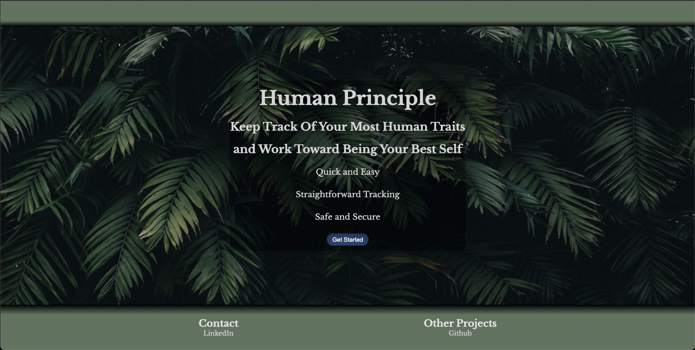
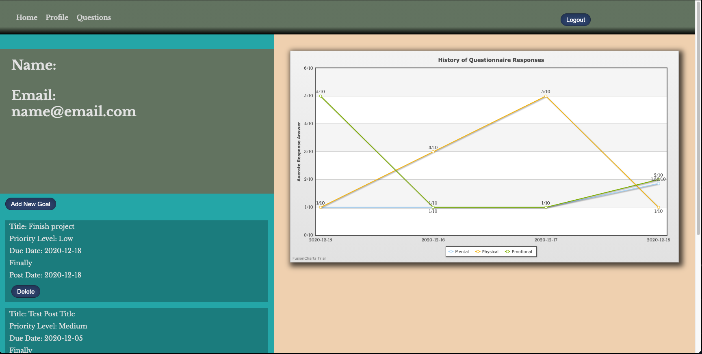
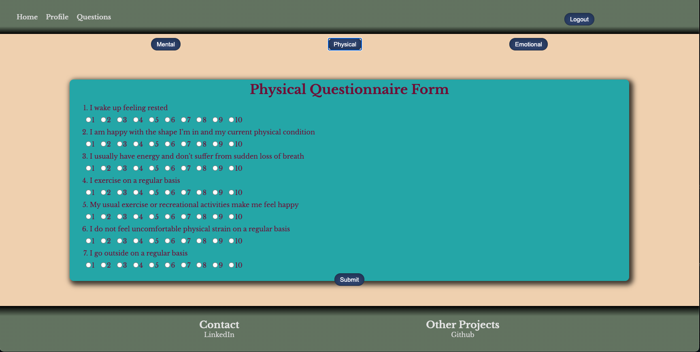

<!-- PROJECT LOGO -->
<br />

  <h3 align="center">Human Principle</h3>

  <p align="center">
    Keep Track of Your Most Human Traits and Work Towards Being Your Best Self
    <br />

<p align="center">
  <a href="https://github.com/chris-a-phillips/human-principle-frontend">
    
    <br/>
  </a>
    <a href="https://github.com/chris-a-phillips/human-principle-frontend/blob/main/README.md"><strong>Explore the docs »</strong></a>
    <br />
    <br />
    <a href="https://github.com/chris-a-phillips/human-principle-frontend">View Demo</a>
    ·
    <a href="https://github.com/othneildrew/Best-README-Template/issues">Report Bug</a>
    ·
    <a href="https://github.com/othneildrew/Best-README-Template/issues">Request Feature</a>
  </p>
</p>


<!-- TABLE OF CONTENTS -->
<details open="open">
  <summary>Table of Contents</summary>
  <ol>
    <li>
      <a href="#about-the-project">About The Project</a>
      <ul>
        <li><a href="#built-with">Built With</a></li>
      </ul>
    </li>
    <li>
      <a href="#getting-started">Getting Started</a>
      <ul>
        <li><a href="#prerequisites">Prerequisites</a></li>
        <li><a href="#installation">Installation</a></li>
      </ul>
    </li>
    <li><a href="#usage">Usage</a></li>
    <li><a href="#roadmap">Roadmap</a></li>
    <li><a href="#contributing">Contributing</a></li>
    <li><a href="#license">License</a></li>
    <li><a href="#contact">Contact</a></li>
    <li><a href="#acknowledgements">Acknowledgements</a></li>
  </ol>
</details>


<!-- ABOUT THE PROJECT -->
## About The Project

This is an app focused on keeping track of how people are doing and the goals they have for themselves. While there is a lot of focus on professional producivity and work, not enough thought is put into the personal side of a person. This app was inspired by the current landscape of remote working.
After a person makes an account they will be able to answer questions about how they feel mentally, physically, and emotionally. This app will keep track of averages of those responses and the user will be able to see a chart of the results. Users can also create goals for themselves and add them to their profile.
Admin users will be able to see all of the questionnaire averages and goals of the team they belong to.

### Built With

* [React](https://reactjs.org/)
* [Styled Components](https://styled-components.com/)
* [Fusion Charts](https://www.fusioncharts.com/)


<!-- GETTING STARTED -->
## Getting Started

To get a local copy up and running follow these simple example steps.

### Prerequisites

* npm
  ```sh
  npm install
  ```

### Installation

1. Clone the repo
   ```sh
   git clone https://github.com/chris-a-phillips/human-principle-frontend.git
   ```
2. Install NPM packages
   ```sh
   npm install
   ```


<!-- USAGE EXAMPLES -->
## Usage

 
 
 

Users have the ability to track themselves over a long period of time and submit as many questionnaires as they would like.
As of now this app is for personal use. In the future it will be expanded for teams and supervisors to use together.

_For more examples, please refer to the [Documentation](https://github.com/chris-a-phillips/human-principle-frontend/blob/main/README.md)_


<!-- ROADMAP -->
## Roadmap

See the [open issues](https://github.com/chris-a-phillips/human-principle-frontend/issues) for a list of proposed features (and known issues).


<!-- CONTRIBUTING -->
## Contributing

There are many features that can still be added to this app. Any contributions you make are **greatly appreciated**.

1. Fork the Project
2. Create your Feature Branch (`git checkout -b feature/AmazingFeature`)
3. Commit your Changes (`git commit -m 'Add some AmazingFeature'`)
4. Push to the Branch (`git push origin feature/AmazingFeature`)
5. Open a Pull Request


<!-- CONTACT -->
## Contact

Chris Phillips - [Github](https://github.com/chris-a-phillips) - phillipsachris@gmail.com

Project Link: [https://github.com/chris-a-phillips/human-principle-frontend](https://github.com/chris-a-phillips/human-principle-frontend)

Deployed Link: [https://human-principle.herokuapp.com/](https://human-principle.herokuapp.com/)


<!-- ACKNOWLEDGEMENTS -->
## Acknowledgements
* [Best-README-Template](https://github.com/othneildrew/Best-README-Template)
